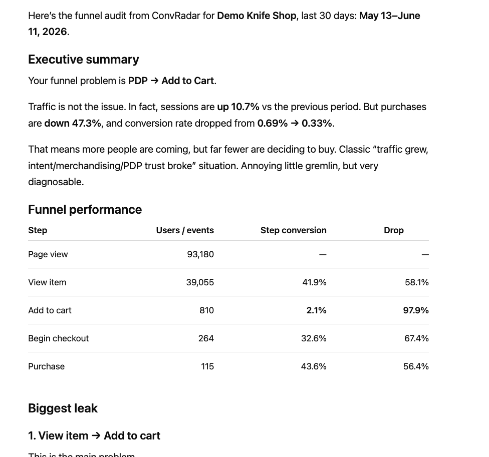
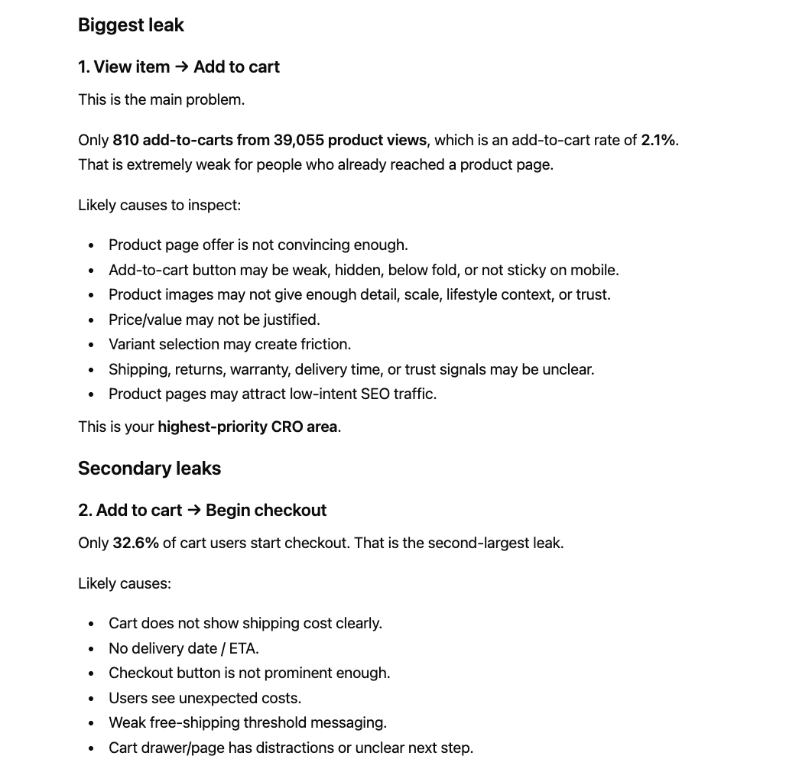
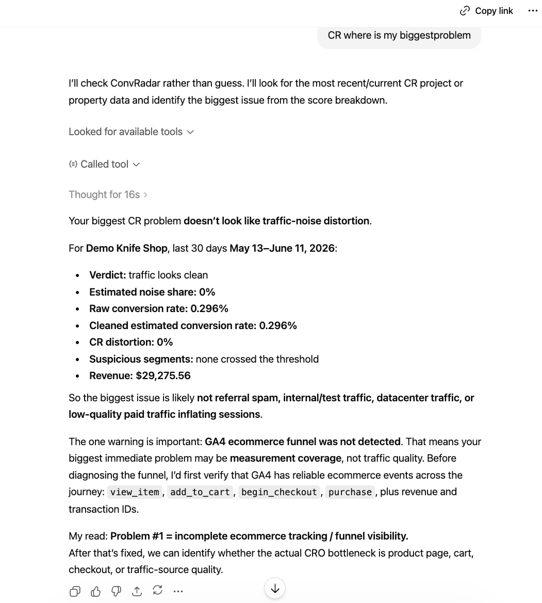

<p align="center">
  
</p>

# ConvRadar — Conversion Analyst inside Claude

Hosted MCP server that turns your **Google Analytics 4** property into a conversation. Ask "where's my biggest funnel drop?" or "did mobile conversion drop last week?" in Claude, ChatGPT, Cursor or Cline — ConvRadar pulls the right slice, runs the diagnostic, and answers with numbers and a recommended action.

- 🌐 **Website:** https://convradar.com
- 💬 **Try without signup (3 free messages):** https://convradar.com/chat
- 🔌 **MCP endpoint:** `https://mcp.convradar.com/mcp`
- 📧 **Contact:** https://convradar.com

> This repository is the public manifest for the hosted ConvRadar MCP server. The server itself is a managed service — there is no self-hosted binary. Use the configuration below to connect any MCP-compatible client to it.

---

## Screenshots

Live output from the connector — funnel audit on the demo tenant in Claude.ai,
traffic-quality verdict in ChatGPT. Full set with paired prompts in [`media/`](media/).







## What ConvRadar does

ConvRadar is a hosted Model Context Protocol (MCP) server. It connects to your Google Analytics 4 property over OAuth (read-only) and exposes 35 conversion-diagnostic tools to any MCP client.

- Runs a **full audit on demand** — funnel drops, traffic-quality regressions, device gaps, landing-page leaks, product/category performance.
- Compares **segments, periods and benchmarks**. Answers in plain English with GA4 numbers attached.
- Records **hypotheses** so the next conversation picks up where the last one ended.

## Works with any GA4 property

ConvRadar isn't e-commerce-only. On connect it detects what kind of property you have and adapts the metrics, funnel and benchmarks to match — so the numbers make sense whether or not you sell anything on-site.

- **E-commerce** — product and category performance, the add-to-cart → checkout → purchase funnel, revenue and AOV.
- **SaaS** — sign-ups, trials and activation as the conversion funnel; engagement where there's no cart.
- **Lead generation** — form submits, demo requests, contact and quote events mapped into a real lead funnel.
- **Mobile & web apps** — app engagement, key-event completion and retention-shaped questions.
- **Content, media and everything else** — engagement, read depth and whatever key events you've defined.

If a property has no e-commerce tracking, ConvRadar won't hand you a misleading 0% conversion rate or $0 revenue. It leads with engagement and the key events you actually fire, and tells you when a metric isn't available instead of reporting a zero as fact.

## Try without installing

Open the demo at **https://convradar.com/chat** — 3 free messages, no signup. The demo runs against a real GA4 property so the answers reflect real data.

## Free tools on convradar.com

The connector is the deep end. Four self-serve instruments on the site cover the shallow end — use them before (or without) connecting anything:

| Tool | What it does | Access |
|---|---|---|
| [🩺 Page Scan](https://convradar.com/page-scan) | Paste any URL — three models read the page and rank the conversion leaks it's quietly losing, pinned to a screenshot. | No login |
| [⚡ Page Speed & UX Check](https://convradar.com/page-speed) | Google PageSpeed score plus a conversion-UX read of the page, in about 30 seconds. | No login |
| [🕹️ Benchmarks](https://convradar.com/benchmarks) | Conversion-rate ranges by industry — see where you land before chasing a number. | No login |
| [🗣️ Voice of Customer](https://convradar.com/voice-of-customer) | Paste your URL — it mines independent customer discussion across your category (Reddit, Quora, niche forums & social threads; your brand's own reviews excluded), ranks the pains by frequency with verbatim quotes and their source links, then grades your page copy against each pain and hands you a prioritized fix list. ~3–5 min per run, report by email. | Free sign-up |

## Connect your client

ConvRadar is a remote OAuth-protected MCP. Any stdio-only client (Claude Desktop, Cursor, Cline, Continue) can connect via `mcp-remote`, which handles the OAuth handshake on first run.

### Claude Desktop / Cursor / Cline

Add this to your client's MCP config (`claude_desktop_config.json`, `~/.cursor/mcp.json`, etc.):

```json
{
  "mcpServers": {
    "convradar": {
      "command": "npx",
      "args": ["-y", "mcp-remote", "https://mcp.convradar.com/mcp"]
    }
  }
}
```

Restart the client. On first tool call, a browser window opens for OAuth — sign in with the same Google account that owns your GA4 property.

### Claude.ai (web)

Add a **Custom Connector** in Settings → Connectors:

- **URL:** `https://mcp.convradar.com/mcp`
- **Auth:** OAuth 2.1 (handled automatically)

### ChatGPT (Plus / Pro)

Add a **Custom MCP Connector** in Settings → Connectors with URL `https://mcp.convradar.com/mcp`.

## Tools

ConvRadar exposes the following tools. The MCP client picks the right one for each question; you don't usually call them by name.

| Tool | What it does |
|---|---|
| `cr_full_audit` | Run a complete conversion audit across funnel, traffic, devices, geos and products. |
| `cr_get_account_info` | GA4 property metadata for the connected account. |
| `cr_get_overview_metrics` | Headline metrics (sessions, users, conversions, revenue) for a period. |
| `cr_get_current_state` | Snapshot of the account's current conversion state. |
| `cr_get_funnel` | The configured funnel with step-by-step drop-off. |
| `cr_diagnose_funnel_drop` | Identify the biggest funnel-step regression and likely cause. |
| `cr_get_traffic_breakdown` | Split traffic by source, medium and campaign. |
| `cr_assess_traffic_quality` | Score traffic sources by engagement and conversion quality. |
| `cr_detect_traffic_quality_change` | Step-changes in traffic quality over a window. |
| `cr_get_device_breakdown` | Sessions and conversions by device category. |
| `cr_get_geo_breakdown` | Sessions and conversions by country and region. |
| `cr_get_landing_pages` | Top landing pages with engagement and conversion. |
| `cr_get_product_analysis` | Product-level revenue and funnel drop-off. |
| `cr_get_product_performance` | Per-product views / add-to-cart / purchases. |
| `cr_query_metrics` | Ad-hoc metric and dimension query against GA4. |
| `cr_describe_data` | Plain-English summary of a dataset slice. |
| `cr_compare_segments` | Compare two GA4 segments side by side. |
| `cr_compare_to_benchmark` | Compare a metric to industry or cohort benchmark. |
| `cr_find_conversion_anomalies` | Statistically significant conversion anomalies. |
| `cr_capture_via_web_fetch` | Capture supporting evidence from a public URL. |
| `cr_list_hypotheses` | List stored hypotheses for the account. |
| `cr_get_hypothesis` | Read a stored hypothesis by ID. |
| `cr_check_page_speed` | Core Web Vitals via PageSpeed Insights, tied to your GA4 mobile-vs-desktop conversion gap. |
| `cr_heuristic_check` | Page speed + AI UX review of the live page — works before GA4 has any data. |
| `cr_get_heuristic_check` | Fetch a heuristic check result by request id (pending until the background run finishes). |
| `cr_capture_screenshots` | Real desktop + mobile screenshots of a page via an anti-bot browser (visual proof). |
| `cr_get_screenshots` | Fetch a queued screenshot capture by request id. |
| `cr_list_capture_sets` | What to look for on each page type before recording a verification. |
| `cr_record_verification` | Record page observables and get hypothesis verdicts. |
| `cr_mark_hypothesis_status` | Track a hypothesis: surfaced → testing → confirmed / rejected. |
| `cr_save_ai_suggested` | Save an AI-suggested hypothesis alongside the verified library. |
| `cr_log_change` | Journal a shipped site change for later impact measurement. |
| `cr_list_changes` | The change diary: what shipped and when, with impact verdicts where measured. |
| `cr_update_change` | Edit or dismiss a diary entry — dismissed rows are retained, never deleted. |
| `cr_verify_change_impact` | Pre/post statistical verdict for a logged change. |

## First prompts to try

After connecting, try:

- *Run a full audit of my account.*
- *Where's my biggest funnel drop?*
- *Did mobile conversion drop last week?*
- *Compare desktop and mobile checkout conversion for the last 30 days.*
- *What should I A/B test next?*

## Auth

- **Protocol:** OAuth 2.1, Bearer token in `Authorization` header.
- **Scopes:** `read:metrics`, `write:hypotheses`.
- **Discovery (RFC 9728):** `GET https://mcp.convradar.com/.well-known/oauth-protected-resource`.
- **No per-user URLs** — `mcp-remote` (or the client's built-in OAuth flow) handles the login on first run.

The OAuth flow only requests read-only GA4 access — ConvRadar can never modify your analytics data.

## Pricing

**Free right now — ConvRadar is in open beta.** No card, no trial countdown, no usage caps. Connect GA4 and use every tool.

When the beta ends it becomes **$9.99 / month flat** (7-day free trial, cancel anytime, no usage caps). Beta users get advance notice before that kicks in.

## Stack

GA4 Data API (read-only) · Claude/ChatGPT MCP · Stripe billing · OAuth 2.1.

## Status

- MCP endpoint: production at `https://mcp.convradar.com/mcp`
- Source: closed. This repository contains the public manifest, install instructions and tool catalogue only.

## Support

Visit https://convradar.com to get in touch.

## License

The contents of this repository (README, manifest, configuration snippets) are released under the [MIT License](./LICENSE). The hosted ConvRadar service itself is proprietary.
